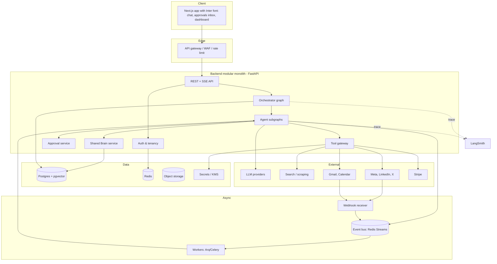

# Cofunder — Architecture, Engineering Practices & Security Plan

AI startup co-founder suite: a supervisor-led swarm of specialist agents (LangGraph) sharing one persistent business brain, traced and evaluated with LangSmith.

---

## 1. Goals and Non-Goals

**Goals**
- Founder enters an idea; agents research, validate, plan, build, market, sell, support, and keep the business legally informed.
- Agents coordinate through shared state and events, not ad-hoc prompt passing.
- Every outbound or irreversible action is gated by human approval until the founder opts into auto-approval per action type.
- Multi-tenant SaaS with strict per-founder data isolation.

**Non-Goals (v1)**
- Guaranteeing revenue outcomes (the system sets a *target milestone*, it does not promise one).
- Replacing a licensed lawyer or accountant.
- Fully autonomous spending or filing.

---

## 2. Architectural Principles

1. **Modular monolith first.** One deployable backend with strict module boundaries; split into services only when a module has a distinct scaling or security need (webhooks, workers).
2. **Ports and adapters.** Business logic never imports a vendor SDK directly. Every external system (LLM, search, Meta, Gmail, Stripe) sits behind an interface.
3. **Agents are subgraphs with contracts.** Each agent exposes typed input, typed output, a declared tool list, and a declared set of events it emits and consumes.
4. **State is data, not prose.** Constraints (budget caps, ICP, pricing) live as structured, versioned records that agents read, not text in a prompt.
5. **Deny by default.** Tools, tenants, network egress, and permissions start closed.
6. **Everything observable.** Every agent run, tool call, approval, and external side effect is traced and auditable.
7. **Idempotent side effects.** Any action that touches the outside world can be retried safely.
8. **Right model for the job.** A System One model makes fast typed decisions, Claude writes and reasons, and plain code enforces hard limits. See Section 17.

---

## 3. High-Level System Architecture

---

## 4. Core Components

### 4.1 Orchestrator (Supervisor)
- Holds the **north-star goal** (founder-set milestone, e.g., "first paying customer by day 90").
- Routes tasks, sets priority, resolves cross-agent conflicts, and raises decisions to the founder.
- Implemented as a LangGraph `StateGraph` with a structured-output router. Specialists are compiled subgraphs added as nodes.
- Reads **events** from the Shared Brain to decide re-planning.

### 4.2 Specialist Agents

| Agent | Responsibility | Gated by |
|---|---|---|
| Market Intelligence | Live signals: trends, sentiment, competitors, risk flags | — |
| Validation | TAM/SAM/SOM, problem severity, go/no-go, pivots | Market Intel |
| Financial | Pricing, projections, break-even, spend constraints | Validation |
| Legal & Compliance | Jurisdiction-aware compliance via cited RAG | — (gates others) |
| Web | Landing page, MVP spec, SEO | Validation, Legal |
| Marketing + Social | GTM, content calendar, publishing, engagement | Financial, Legal |
| Sales | Outreach, CRM, objection handling | Marketing, Financial, Legal |
| Support & Reception | Inbound chat/email/WhatsApp/voice, booking, escalation | Grounded KB |
| Operations/Inventory | Stock, supplier orders, runway (product businesses only) | Financial |

### 4.3 Shared Brain
A service (not a global dict) that owns:
- **Venture profile**: idea, positioning, ICP, jurisdiction, brand voice, stage.
- **Constraints**: monthly budget cap, max CAC, outreach volume cap (structured, versioned).
- **Event log**: append-only domain events.
- **Decision log**: what was decided, by which agent or human, with rationale and evidence links.
- **Knowledge**: research artifacts (summarized) and embeddings in pgvector.

### 4.4 Tool Gateway
Single choke point for all external side effects:
- Validates arguments (Pydantic), checks agent's tool allowlist, checks tenant scope.
- Enforces rate limits, timeouts, retries with backoff, idempotency keys.
- Routes through Approval service for any tool marked `requires_approval`.
- Logs a redacted audit record for each call.

### 4.5 Approval Service
- Stores pending approvals (action, payload, risk level, requester agent, expiry).
- LangGraph `interrupt()` pauses the run; UI approves, edits, or rejects; run resumes via `Command(resume=...)`.
- Per-tenant auto-approval policies by action type.

### 4.6 Event Bus and Workers
- Redis Streams carry domain events and webhook-originated events.
- Workers handle scheduled posts, follow-up sequences, market-signal polling, and inbound message graphs.

### 4.7 Legal RAG Pipeline
- Ingest official sources only (government gazettes, regulator sites), per jurisdiction.
- Retrieval returns passages with citations; answers must cite or abstain.

### 4.8 Frontend
- Next.js 15 + Tailwind CSS 4 + shadcn/ui.
- **Inter font** applied as primary base font via `next/font/google`.
- SSE for streaming agent progress, approvals inbox, venture dashboard.

### 4.9 Decision Layer (System One)
- Fast, typed decisions behind a `DecisionModel` port.
- TypeSafe's hosted Jev first; self-hosted open-source System One model later.

---

## 5. Technology Stack & Font Specifications

### Frontend
- **Framework:** Next.js 15 (App Router) + React 19 + TypeScript (strict). Node 22 LTS.
- **Typography:** **Inter font** (`next/font/google` variable font) configured across `html`/`body` and components.
- **Styling/UI:** Tailwind CSS 4 + shadcn/ui.
- **Server state:** TanStack Query. **Client state:** Zustand.
- **Forms/validation:** react-hook-form + Zod.
- **Streaming:** SSE over `fetch` streams for agent progress and approval notifications.

### Backend & Agents
- **Runtime:** Python 3.12 managed with `uv`.
- **API:** FastAPI + Uvicorn.
- **Database:** PostgreSQL 16 + pgvector on AWS RDS with Row-Level Security.
- **Cache/Event Bus:** Redis 7 (Redis Streams) on AWS ElastiCache.
- **Orchestration:** LangGraph with `AsyncPostgresSaver` and LangGraph `Store`.
- **Observability:** LangSmith (tracing, evals, Prompt Hub).
- **Models:** Claude 3.5 Sonnet (reasoning/writing), Claude 3.5 Haiku (fast classification/fallback), TypeSafe Jev (System One decision layer).
