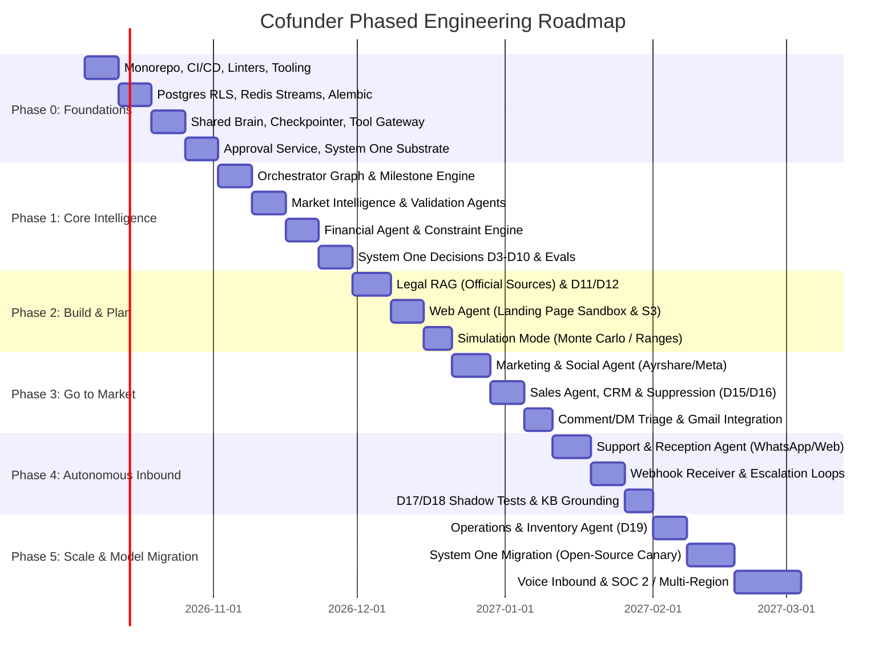
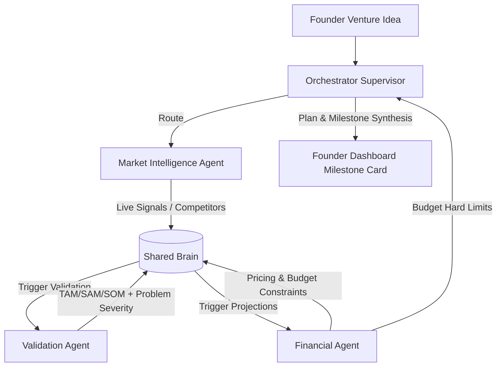
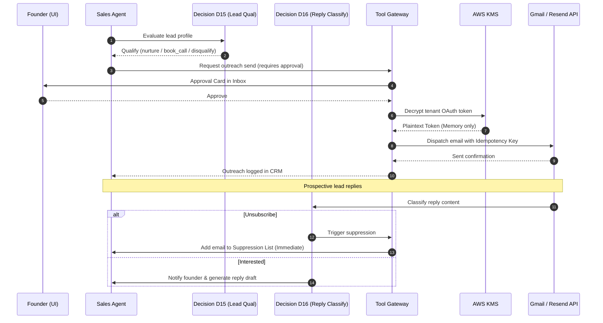
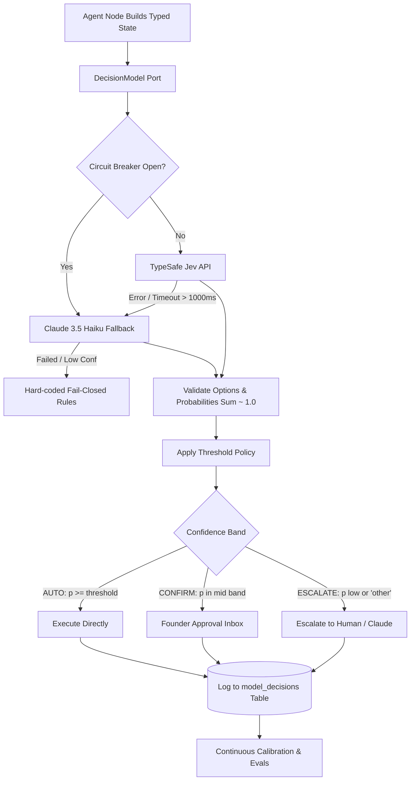

# Cofunder — Master Implementation Plan

This implementation plan translates the **Cofunder Architecture, Engineering Practices & Security Plan** into an actionable, sprint-by-sprint execution roadmap. It spans **Phases 0 through 5**, detailing concrete tasks, module boundaries, database schemas, interfaces, agent graphs, System One decision integrations, security controls, and acceptance criteria.

---

## 1. System Architecture Traceability & Milestone Matrix



### Summary of Phases & Workstreams

| Phase | Duration | Core Deliverables | Critical Security & Quality Gates |
|---|---|---|---|
| **Phase 0 — Foundations** | Weeks 1–3 | Monorepo scaffolding, Postgres RLS, Redis Streams event bus, Shared Brain, Tool Gateway, Approval Service (`interrupt()`), Clerk Auth, System One Base (D1, D2), Next.js UI Shell. | Cross-tenant isolation automated test suite passes 100%; D1 and D2 fail-closed verification; Layer dependency enforcement via `import-linter`. |
| **Phase 1 — Core Intelligence** | Weeks 4–6 | Orchestrator graph, Market Intelligence, Validation, Financial agent, Decisions D3–D10, LangSmith automated eval pipelines, Simulation sandbox. | Financial constraints strictly enforced as immutable code checks; Rubric scoring evidence traceability; Ground-truth eval datasets in CI. |
| **Phase 2 — Build & Regulatory** | Weeks 7–9 | Legal RAG with cited official gazettes, Legal Gate (D11, D12), Web Agent MVP generator, S3/CloudFront isolated preview deployment. | Mandatory citation or abstention (abstain on score < threshold); Output HTML sanitization; Subprocess/headless browser sandboxing. |
| **Phase 3 — Go to Market** | Weeks 10–12 | Marketing & Social agent (Ayrshare/Meta), Sales Agent & CRM, Comment/DM triage (D13, D14), Outreach reply classification (D15, D16), Gmail OAuth KMS encryption. | Immediate automatic unsubscribe suppression; Zero unapproved outbound actions; Anti-SSRF validation on external webhooks. |
| **Phase 4 — Inbound Operations** | Weeks 13–15 | Support & Reception agent (WhatsApp Cloud API, Web chat), D17 & D18 triage/frustration detection, dedicated webhook receiver deployable. | Webhook HMAC-SHA256 signature verification; Customer data grounding without hallucination; Rate limiting & WAF rules at edge. |
| **Phase 5 — Scale & Migration** | Weeks 16+ | Operations/Inventory agent (D19), System One open-source model migration (SemIf/Kev canary cutover), Twilio Voice, Vanta SOC 2 readiness. | External penetration test; Zero data leakage across tenant boundaries; Multi-region data residency (India DPDP & GDPR). |

---

## 2. Phase 0: Foundations & Substrate (Weeks 1–3)

### Objective
Establish the modular monolith, strict layer dependencies, database with row-level security, event streaming, tool sandbox, approval lifecycle, and the System One decision layer foundation.

### Sprint 0.1: Monorepo, Dev Tooling & Layer Boundary Enforcement
- [ ] **Repository Setup**: Initialize directory tree matching Section 7:
  ```
  cofunder/
  ├── apps/{api, worker, webhooks, web}
  ├── packages/{core, brain, agents, tools, integrations, rag, approvals, security, decisions, observability}
  ├── evals/, docs/decisions/, scripts/, infra/, tests/
  ├── AGENTS.md, pyproject.toml, ruff.toml
  ```
- [ ] **Dependency Management**: Setup Python 3.12 with `uv`. Lockfile generation via `uv lock`.
- [ ] **Linters & Type Checkers**:
  - Configure `ruff` for formatting and linting (line length 100, strict pyflakes, bugbear, isort).
  - Configure `mypy --strict` targeting `packages/`.
  - Configure `import-linter` contracts:
    - `core` cannot import any other internal package.
    - `brain`, `rag`, `security` may only import `core`.
    - `tools`, `integrations`, `approvals`, `decisions` may import `core`, `security`.
    - `agents` may import `core`, `brain`, `tools`, `approvals`, `decisions`, `rag`, `security`.
    - `apps` may import all packages.
    - Agents cannot import other agents.
- [ ] **CI Pipeline (GitHub Actions)**: Create `.github/workflows/ci.yml` running ruff, mypy, import-linter, and secret scanning (`gitleaks`).
- [ ] **Documentation Generator**: Implement `scripts/gen_module_index.py` that verifies and updates `<!-- BEGIN GENERATED -->` blocks in all `README.md` files.

### Sprint 0.2: Postgres Schema, Row-Level Security & Redis Streams
- [ ] **Database Connection Pool**: Set up `SQLAlchemy 2.0` (async) with `psycopg 3` driver in `packages/core/db.py`.
- [ ] **Alembic Migration Infrastructure**: Setup forward-only migrations.
- [ ] **Core Tables & RLS Policies**: Create migration for core tables:
  ```sql
  CREATE TABLE tenants (
      id UUID PRIMARY KEY DEFAULT gen_random_uuid(),
      name VARCHAR(255) NOT NULL,
      plan VARCHAR(50) NOT NULL DEFAULT 'standard',
      created_at TIMESTAMPTZ NOT NULL DEFAULT NOW()
  );

  CREATE TABLE ventures (
      id UUID PRIMARY KEY DEFAULT gen_random_uuid(),
      tenant_id UUID NOT NULL REFERENCES tenants(id) ON DELETE CASCADE,
      name VARCHAR(255) NOT NULL,
      idea TEXT NOT NULL,
      jurisdiction VARCHAR(50) NOT NULL,
      stage VARCHAR(50) NOT NULL DEFAULT 'ideation',
      goal_json JSONB NOT NULL,
      created_at TIMESTAMPTZ NOT NULL DEFAULT NOW()
  );
  ALTER TABLE ventures ENABLE ROW LEVEL SECURITY;
  CREATE POLICY tenant_isolation_ventures ON ventures
      USING (tenant_id = current_setting('app.tenant_id')::uuid);

  CREATE TABLE constraints (
      id UUID PRIMARY KEY DEFAULT gen_random_uuid(),
      venture_id UUID NOT NULL REFERENCES ventures(id) ON DELETE CASCADE,
      version INT NOT NULL DEFAULT 1,
      budget_cap NUMERIC(12,2) NOT NULL,
      max_cac NUMERIC(12,2) NOT NULL,
      outreach_cap INT NOT NULL,
      created_at TIMESTAMPTZ NOT NULL DEFAULT NOW()
  );

  CREATE TABLE events (
      id UUID PRIMARY KEY DEFAULT gen_random_uuid(),
      tenant_id UUID NOT NULL REFERENCES tenants(id) ON DELETE CASCADE,
      venture_id UUID NOT NULL REFERENCES ventures(id) ON DELETE CASCADE,
      type VARCHAR(100) NOT NULL,
      version INT NOT NULL DEFAULT 1,
      payload JSONB NOT NULL,
      emitted_by VARCHAR(100) NOT NULL,
      occurred_at TIMESTAMPTZ NOT NULL DEFAULT NOW(),
      causation_id UUID,
      correlation_id UUID
  );
  ALTER TABLE events ENABLE ROW LEVEL SECURITY;
  CREATE POLICY tenant_isolation_events ON events
      USING (tenant_id = current_setting('app.tenant_id')::uuid);

  CREATE TABLE model_decisions (
      id UUID PRIMARY KEY DEFAULT gen_random_uuid(),
      tenant_id UUID NOT NULL REFERENCES tenants(id) ON DELETE CASCADE,
      venture_id UUID NOT NULL REFERENCES ventures(id) ON DELETE CASCADE,
      use_case VARCHAR(100) NOT NULL,
      model_provider VARCHAR(50) NOT NULL,
      model_version VARCHAR(50) NOT NULL,
      state_hash VARCHAR(64) NOT NULL,
      choice VARCHAR(100) NOT NULL,
      probabilities JSONB NOT NULL,
      outcome VARCHAR(50) NOT NULL,
      human_override BOOLEAN NOT NULL DEFAULT FALSE,
      latency_ms INT NOT NULL,
      created_at TIMESTAMPTZ NOT NULL DEFAULT NOW()
  );
  ALTER TABLE model_decisions ENABLE ROW LEVEL SECURITY;
  CREATE POLICY tenant_isolation_decisions ON model_decisions
      USING (tenant_id = current_setting('app.tenant_id')::uuid);
  ```
- [ ] **Tenant Context Middleware**: FastAPI middleware in `apps/api/middleware/tenancy.py` extracting tenant ID from verified Clerk JWT and executing `SET LOCAL app.tenant_id = :tenant_id` for every session checkout.
- [ ] **Cross-Tenant Test Suite**: Implement `tests/security/test_tenant_isolation.py` verifying that Tenant B cannot read or modify Tenant A records across all API endpoints and repository queries.
- [ ] **Redis Streams Event Bus**: Implement `packages/core/events.py` and `packages/core/event_bus.py` with publish, consume, consumer groups, idempotency deduping, and dead-letter queue (DLQ) streams.

### Sprint 0.3: Shared Brain Service, Checkpointer & Tool Gateway
- [ ] **LangGraph Postgres Checkpointer**: Setup `AsyncPostgresSaver` in `packages/brain/checkpointer.py` using the shared psycopg 3 connection pool.
- [ ] **Shared Brain Interface**: Implement `packages/brain/service.py`:
  - `get_venture_profile(venture_id)`
  - `get_active_constraints(venture_id)`
  - `record_decision(venture_id, summary, rationale, evidence_refs)`
  - `append_domain_event(event)`
- [ ] **Tool Gateway Architecture**: Implement `packages/tools/gateway.py`:
  - Spec registry with Pydantic argument validation.
  - Agent allowlist checker (`agent.allowed_tools`).
  - Tenant rate limiter via Redis sliding window.
  - Idempotency store checking `(run_id, tool_name, hash(args))` before execution.
  - Auditing wrapper logging redacted arguments and execution outcome to `audit_log`.
- [ ] **Egress Proxy / SSRF Filter**: Implement `packages/security/egress.py`:
  - Enforce DNS re-resolution and IP check blocking RFC1918, RFC3927 (link-local `169.254.169.254`), and loopback addresses.
  - Strict HTTP response size and timeout limits.

### Sprint 0.4: Approval Service & Human-In-The-Loop Flow
- [ ] **Approval Storage & State**: Tables for `approvals` with statuses (`pending`, `approved`, `rejected`, `expired`, `auto_approved`).
- [ ] **LangGraph Interrupt Handling**:
  - In `packages/approvals/service.py`, implement approval check node.
  - Trigger `interrupt({"action": tool_name, "payload": args, "risk": risk_score})` when approval is required.
  - API endpoint `POST /v1/approvals/{id}/resolve` accepts `{status: approved|rejected, modifications: dict}` and calls `Command(resume=...)`.
- [ ] **Tenant Auto-Approval Policies**: Configurable policies by action type. Payments and filings hard-coded to never auto-approve.

### Sprint 0.5: System One Decision Layer Base (Jev Adapter, D1, D2)
- [ ] **Decision Ports & Models**: Implement `packages/decisions/ports.py` with `Question`, `Decision`, and `DecisionModel` protocol.
- [ ] **TypeSafe Jev Adapter**: Implement `packages/decisions/adapters/jev_client.py`:
  - HTTP client with retry backoff, 1000ms hard timeout, and circuit breaker.
  - Fallback adapter chain: `jev_client -> claude_haiku_fallback -> fail_closed_or_escalate`.
- [ ] **Policy & Threshold Engine**: Implement `packages/decisions/policy/apply_threshold.py` mapping probabilities to `AUTO`, `CONFIRM`, `ESCALATE`.
- [ ] **Decision D1 Implementation**: `packages/decisions/definitions/approval_risk.py` (`low | medium | high | block`). Fail-closed to `CONFIRM` / `block`.
- [ ] **Decision D2 Implementation**: `packages/decisions/definitions/screen_untrusted_content.py` (`safe | suspicious | injection`). Fail-closed to `suspicious` (quarantined).

### Sprint 0.6: Next.js Frontend Shell & Streaming API Gateway
- [ ] **Next.js 15 Project Setup**: App Router, Tailwind CSS 4, shadcn/ui components in `apps/web/`.
- [ ] **Typography & Design System**: Configure `next/font/google` with **Inter** font family (`--font-inter`) as the primary base font applied across `html`/`body`, layouts, dashboards, and approval modals for a modern, crisp UI.
- [ ] **Clerk Auth Integration**: User authentication, Organization switcher for tenant selection.
- [ ] **SSE Streaming Client**: Implement EventSource / fetch stream consumer in `apps/web/hooks/use-agent-stream.ts` to stream graph node updates and approval triggers in real-time.
- [ ] **Approvals Inbox Component**: UI view to inspect pending tool payloads, display diffs, approve, reject, or edit.

### Phase 0 Exit Criteria & Definition of Done
1. `uv run pytest tests/security/test_tenant_isolation.py` passes 100% with zero data leaks across tenants.
2. A test LangGraph workflow successfully triggers `interrupt()` on a simulated side-effect tool, renders in the UI inbox, and resumes cleanly upon approval.
3. Decision D1 and D2 successfully classify payloads and fail-closed when the Jev adapter is artificially interrupted.
4. CI passes `ruff`, `mypy --strict`, and `import-linter` with zero violations.

---

## 3. Phase 1: Core Intelligence Engine (Weeks 4–6)

### Objective
Build the Supervisor Orchestrator, Market Intelligence, Validation, and Financial agents, wired to the Shared Brain and evaluated with LangSmith.



### Sprint 1.1: Orchestrator (Supervisor) Graph & Milestone Engine
- [ ] **State Schema**: Define `OrchestratorState` with venture goals, active sub-agent states, pending decisions, and domain events.
- [ ] **North-Star Milestone Engine**: Model milestone progress (e.g., "Day 90 First Paid User", target metrics, stage gating).
- [ ] **Structured Router Node**: LangGraph router utilizing Decision D3 (`route_supervisor.py`) with fallback to Claude 3.5 Sonnet.
- [ ] **Event Consumer Node**: Reads domain events (`pricing_changed`, `regulation_risk_flagged`) from Redis Streams and computes re-planning tasks.

### Sprint 1.2: Market Intelligence Agent
- [ ] **Package Structure**: Initialize `packages/agents/market_intel/`.
- [ ] **Live Signal Adapters**:
  - `TavilySearchAdapter` in `packages/integrations/adapters/tavily.py`.
  - `FirecrawlScraperAdapter` in `packages/integrations/adapters/firecrawl.py`.
  - Feeds: Hacker News Algolia API, Reddit official API, Product Hunt API.
- [ ] **Signal Triage Node (D7)**: Filter raw scraped noise into structured signals (`competitor_move`, `regulation`, `sentiment_shift`).
- [ ] **Competitor Analysis Node**: Extract competitor list, positioning, feature gaps, and pricing models.
- [ ] **Pain-Point Extractor (D8)**: Tag complaints and feature requests from forum and review scrape data.

### Sprint 1.3: Validation Agent
- [ ] **Package Structure**: Initialize `packages/agents/validation/`.
- [ ] **Market Sizing Engine**: Pure calculation module for TAM, SAM, SOM with stated, transparent formulas.
- [ ] **Timing Score & Problem Severity Rubric**:
  - Pure calculation modules in `packages/agents/validation/scoring/`.
  - Factors: search trend slopes, complaint frequencies, competitor density, funding velocity.
  - Every score requires an array of direct evidence links.
- [ ] **Go / No-Go Decision Synthesis**: Generates validation report artifact saved to Shared Brain; emits `idea_validated` event.

### Sprint 1.4: Financial Agent & Constraint Enforcement
- [ ] **Package Structure**: Initialize `packages/agents/financial/`.
- [ ] **Unit Economics & Break-Even Modeling**: Formulate revenue models, gross margin calculators, payback periods, and runway projections.
- [ ] **Constraint Engine**:
  - Validates and writes versioned rows to `constraints` table in Shared Brain (`budget_cap`, `max_cac`, `outreach_cap`).
  - Hard constraint checks: plain Python code guards in `packages/core/constraints.py` that reject agent proposals exceeding budget caps.

### Sprint 1.5: System One Decisions D3–D10 Implementation
- [ ] **D3 Supervisor Routing**: `packages/decisions/definitions/route_supervisor.py`.
- [ ] **D4 Model Tier Routing**: `packages/decisions/definitions/route_model_tier.py` (`haiku | sonnet | no_llm_needed`).
- [ ] **D5 Event Fan-Out**: `packages/decisions/definitions/fan_out_event.py` (`replan_now | replan_later | ignore`).
- [ ] **D6 Founder Intent Classifier**: `packages/decisions/definitions/classify_founder_intent.py`.
- [ ] **D7 Signal Triage**: `packages/decisions/definitions/triage_signal.py`.
- [ ] **D8 Pain-Point Tagging**: `packages/decisions/definitions/tag_pain_point.py`.
- [ ] **D9 Trace Quality Judge**: `packages/decisions/definitions/judge_trace_quality.py`.
- [ ] **D10 Context Compaction**: `packages/decisions/definitions/select_context_to_keep.py`.

### Sprint 1.6: LangSmith Eval Pipelines & CI Regression Gates
- [ ] **LangSmith Project Setup**: Isolate workspaces per environment (`cofunder-eval-dev`, `cofunder-eval-ci`).
- [ ] **Dataset Creation**: Seed benchmark datasets for Validation (known startups with outcomes) and Supervisor routing.
- [ ] **CI Regression Runner**: Implement `evals/suites/run_ci_evals.py` using `langsmith.evaluation.evaluate()`. Fail PRs if routing accuracy drops > 3% or rubric hallucination rate > 0%.

### Phase 1 Exit Criteria & Definition of Done
1. Entering a raw venture idea into the UI yields an end-to-end execution resulting in a cited Market Intelligence dossier, a validated TAM/SAM/SOM report, and a Financial constraint model.
2. Financial budget constraints are verified to halt simulated over-budget agent spending requests.
3. LangSmith CI evals for Router and Validation rubrics execute and pass benchmark thresholds.

---

## 4. Phase 2: Build & Regulatory Guardrails (Weeks 7–9)

### Objective
Implement the Legal & Compliance RAG agent (official sources, mandatory citation/abstention), the Web Agent for landing page creation in an isolated sandbox, and the Simulation Engine.

### Sprint 2.1: Legal & Compliance RAG Engine
- [ ] **Ingest Pipeline**: Document parser using `pymupdf4llm` to process official statutes, gazettes, and regulatory guidelines (e.g., India DPDP Act 2023, Companies Act 2013).
- [ ] **Chunking & Metadata Strategy**: Semantic chunking preserving statutory section hierarchy, act name, enactment date, source URL.
- [ ] **Hybrid Search Index**:
  - Voyage AI `voyage-3-large` embeddings stored in `pgvector` HNSW index.
  - Postgres Full-Text Search (tsvector) on statute text.
  - Reciprocal Rank Fusion (RRF) combining vector and keyword hits, followed by Voyage Reranker.
- [ ] **Answer or Abstain Gate (D11)**: `packages/decisions/definitions/gate_legal_answer.py`. If retrieval score or citation confidence is below threshold, output strictly abstains and triggers legal disclaimer.

### Sprint 2.2: Compliance Screening Gate (D12)
- [ ] **Screening Definition**: `packages/decisions/definitions/screen_compliance.py` (`clean | regulated_claim | missing_disclosure | consent_issue`).
- [ ] **Automated Content Gating**: Hook into the Tool Gateway to scan all public-facing text (landing page copy, ad text, outreach templates). Any non-clean classification halts the flow and creates an approval task.

### Sprint 2.3: Web Agent & Isolated Landing Page Generator
- [ ] **Package Structure**: Initialize `packages/agents/web/`.
- [ ] **Landing Page Generation Node**: Generates single-page HTML/Tailwind MVP landing page with value proposition, features, and email capture form.
- [ ] **HTML Sanitization & CSP Guard**: Strip all inline script tags, verify external asset URLs against allowlist.
- [ ] **Sandboxed Deployment Adapter**: Uploads static assets to a dedicated user-content S3 bucket (`cofunder-sites-sandbox`) served through CloudFront on a separate domain (e.g., `*.cofundersites.com`), entirely isolated from the primary SaaS origin.

### Sprint 2.4: Simulation Mode (Scenario Analysis)
- [ ] **Sandbox Runner**: LangGraph subgraph configured with side-effect tools disabled (`allowed_tools=frozenset()`).
- [ ] **Scenario Ranges**: Computes best-case, base-case, and worst-case runway, customer acquisition, and cash flow curves.
- [ ] **Assumption & Blind-Spot Highlighter**: Explicitly flags assumptions and unvalidated dependencies for founder review.

### Phase 2 Exit Criteria & Definition of Done
1. Legal agent accurately cites exact sections of ingested statutes and demonstrates 100% abstention on out-of-corpus or ambiguous queries.
2. Web Agent generates a landing page, screens it through D12 compliance, and deploys it to the isolated sandbox domain upon founder approval.
3. Simulation mode generates multi-scenario financial forecasts with explicit assumptions without triggering any external side-effect tools.

---

## 5. Phase 3: Go-To-Market Execution (Weeks 10–12)

### Objective
Deploy the Marketing & Social agent and Sales agent with CRM tracking, automated suppression list management, and OAuth token encryption.



### Sprint 3.1: Marketing & Social Agent
- [ ] **Package Structure**: Initialize `packages/agents/marketing/`.
- [ ] **Social Integration Adapter**: Implement Ayrshare adapter in `packages/integrations/adapters/ayrshare.py` for scheduled multi-platform publishing (LinkedIn, X, Instagram, Facebook).
- [ ] **Brand Voice & Platform Fit (D14)**: `packages/decisions/definitions/check_brand_voice_fit.py` (`pass | revise`). Revisions automatically trigger redrafts.
- [ ] **Content Calendar Management**: Scheduled social post items persisted to Postgres and triggered via `Arq` cron workers.

### Sprint 3.2: Sales Agent, CRM & Suppression Lists
- [ ] **Package Structure**: Initialize `packages/agents/sales/`.
- [ ] **Internal Postgres CRM**: Tables for `leads`, `deals`, `activities`, and `suppression_list`.
- [ ] **Lead Qualification (D15)**: `packages/decisions/definitions/qualify_lead.py` (`nurture | book_call | disqualify`).
- [ ] **Outreach Reply Classifier (D16)**: `packages/decisions/definitions/classify_outreach_reply.py` (`interested | objection | not_now | out_of_office | unsubscribe | other`).
- [ ] **Immediate Unsubscribe Suppression**: Automatic insertion into `suppression_list` upon `unsubscribe` classification; Tool Gateway blocks sends to any suppressed email address at the code level.

### Sprint 3.3: Inbound Comment/DM Triage & Crisis Alerting
- [ ] **Triage Engine (D13)**: `packages/decisions/definitions/triage_comment_or_dm.py` (`spam | lead | complaint | question | crisis`).
- [ ] **Crisis Alerting**: Immediate push notification and email alert to the founder for `crisis` classifications; automated replies blocked.

### Sprint 3.4: Customer OAuth & Token Envelope Encryption
- [ ] **KMS Envelope Encryption**: Implement `packages/security/crypto.py` utilizing AWS KMS to encrypt and decrypt customer OAuth tokens (Gmail, Meta) using per-tenant encryption context.
- [ ] **Gmail API Adapter**: Implement `packages/integrations/adapters/gmail.py` for sending outreach emails through founder Gmail accounts.
- [ ] **Meeting Booking Adapter**: Implement Cal.com API sync in `packages/integrations/adapters/calcom.py`.

### Phase 3 Exit Criteria & Definition of Done
1. Outreach campaigns generate personalized drafts gated by human approval.
2. Inbound replies containing "stop" or "unsubscribe" automatically append to the suppression list and halt further communications without human intervention.
3. Customer OAuth tokens are verified to be encrypted in the database and never appear in traces, logs, or LLM context.

---

## 6. Phase 4: Autonomous Inbound & Customer Operations (Weeks 13–15)

### Objective
Deploy the Support & Reception agent across Web chat and WhatsApp Cloud API, supported by a dedicated webhook receiver and grounded knowledge base.

### Sprint 4.1: Dedicated Webhook Receiver Deployable
- [ ] **Standalone App**: Setup `apps/webhooks/main.py` as an isolated, minimal FastAPI deployable.
- [ ] **Cryptographic Signature Verification**:
  - Meta `X-Hub-Signature-256` constant-time verification.
  - Stripe signature verification.
- [ ] **Event Enqueueing**: Receiver immediately acks HTTP 200 and pushes raw payloads to Redis Streams `incoming_webhooks` for asynchronous worker processing.

### Sprint 4.2: Support & Reception Agent Subgraph
- [ ] **Package Structure**: Initialize `packages/agents/support/`.
- [ ] **Inbound Routing (D17)**: `packages/decisions/definitions/route_inbound_message.py` (`answer_from_kb | book_meeting | escalate | spam`).
- [ ] **Frustration & Churn Detection (D18)**: `packages/decisions/definitions/detect_frustration.py` (`calm | frustrated | urgent_risk`). `frustrated` and above bypass automation and escalate to the founder.
- [ ] **Grounded Knowledge Base Q&A**: Answers strictly generated from the venture's approved knowledge base; abstains and escalates when confidence is below threshold.

### Sprint 4.3: WhatsApp Cloud API & Two-Way Messaging
- [ ] **WhatsApp Adapter**: Implement `packages/integrations/adapters/whatsapp.py` using official WhatsApp Business Cloud API.
- [ ] **Message Session Management**: Redis-backed session tracking mapping phone numbers to tenant/venture threads.

### Sprint 4.4: Inbound Triage Evaluation Suite
- [ ] **Eval Dataset**: Curate 200+ multi-turn customer support interactions labeled with ground-truth routing and frustration levels.
- [ ] **Offline Evals**: Measure precision and recall of D17 and D18 to verify escalation safety.

### Phase 4 Exit Criteria & Definition of Done
1. Webhooks are ingested by the dedicated receiver with verified cryptographic signatures and zero dropped events.
2. Inbound customer queries are answered accurately from the grounded KB or escalated to human inbox when frustration/out-of-scope intent is detected.
3. No hallucinated claims or unauthorized business commitments occur in customer interaction traces.

---

## 7. Phase 5: Scale, Enterprise Readiness & Model Migration (Weeks 16+)

### Objective
Add Operations/Inventory agent (D19), migrate System One decisions from hosted Jev to self-hosted open-source models, introduce Twilio Voice, and achieve SOC 2 compliance.

### Sprint 5.1: Operations & Inventory Agent
- [ ] **Package Structure**: Initialize `packages/agents/operations/`.
- [ ] **Inventory Decision (D19)**: `packages/decisions/definitions/decide_inventory_action.py` (`reorder_now | wait | review`).
- [ ] **Deterministic Stock Level Forecasting**: Pure Python forecasting algorithms; all reorder actions gated by human approval.

### Sprint 5.2: System One Open-Source Model Migration
- [ ] **Candidate Benchmark Harness**: Setup evaluation harness in `packages/decisions/tests/test_model_migration.py` comparing TypeSafe Jev against candidates (SemIf / Kev) on Cofunder's historical `model_decisions` dataset.
- [ ] **Shadow Mode Deployment**: Run the open-source candidate in parallel in the worker cluster; log predictions and compare latency, calibration error, and agreement rate.
- [ ] **Canary Rollout by Risk Tier**:
  1. Tier 1 (Low Risk): D6 (Founder Intent), D7 (Signal Triage), D10 (Context Compaction).
  2. Tier 2 (Medium Risk): D3 (Supervisor Routing), D15 (Lead Qual), D17 (Inbound Routing).
  3. Tier 3 (High Risk): D1 (Approval Risk), D2 (Untrusted Content), D12 (Compliance).
- [ ] **Automated Fallback**: Dynamic feature flag routing traffic back to hosted Jev or Claude Haiku if error rates or calibration diverge.

### Sprint 5.3: Voice Receptionist (Twilio + Deepgram + ElevenLabs)
- [ ] **Voice Pipeline**: Twilio Voice media streams routed via WebSockets to Deepgram for streaming STT, processed by Support Agent, and synthesized with ElevenLabs TTS.

### Sprint 5.4: Compliance & Infrastructure Hardening
- [ ] **SOC 2 Type 1 / Vanta Automation**: Automated infrastructure evidence collection for access reviews, change management, and backup verification.
- [ ] **External Penetration Testing**: Third-party gray-box security audit covering API, sandbox isolation, and prompt injection red-teaming.
- [ ] **Multi-Region Data Residency**: Implement region-isolated tenant routing supporting India (`ap-south-1`) and EU (`eu-central-1`).

### Phase 5 Exit Criteria & Definition of Done
1. Open-source System One models run within the AWS VPC, matching or exceeding hosted Jev precision at lower p95 latency.
2. Voice reception handles simulated customer calls with low-latency turn-taking and graceful escalation.
3. External penetration test remediated with zero critical or high vulnerabilities.

---

## 8. Cross-Cutting Technical Blueprints

### 8.1 Tool Gateway Guard Implementation

```python
# packages/tools/gateway.py
import hashlib
import json
from typing import Any
from packages.core.errors import PolicyViolation, ApprovalRequired
from packages.core.context import AgentContext
from packages.tools.registry import tool_registry
from packages.approvals.service import ApprovalService
from packages.security.redaction import redact_sensitive_data
from packages.observability.tracer import tracer

class ToolGateway:
    def __init__(self, approval_service: ApprovalService, audit_logger: Any, idempotency_store: Any):
        self.approval_service = approval_service
        self.audit_logger = audit_logger
        self.idempotency_store = idempotency_store

    def _generate_idempotency_key(self, run_id: str, tool_name: str, args: dict[str, Any]) -> str:
        serialized = json.dumps(args, sort_keys=True)
        return hashlib.sha256(f"{run_id}:{tool_name}:{serialized}".encode()).hexdigest()

    async def execute_tool(self, ctx: AgentContext, name: str, raw_args: dict[str, Any]) -> Any:
        spec = tool_registry.get(name)
        if not spec:
            raise PolicyViolation(f"Unknown tool: {name}")

        # 1. Allowlist enforcement
        if name not in ctx.agent.allowed_tools:
            raise PolicyViolation(f"Agent '{ctx.agent.name}' is unauthorized to call '{name}'")

        # 2. Strict Pydantic Argument Validation
        validated_args = spec.args_model.model_validate(raw_args)

        # 3. Code-Level Hard Constraint Check (Budget / Suppression)
        spec.policy_check(ctx.tenant_id, ctx.venture_id, validated_args)

        # 4. Human-In-The-Loop Approval Check
        if spec.requires_approval:
            is_granted = await self.approval_service.is_approved(ctx, name, validated_args)
            if not is_granted:
                # Triggers LangGraph interrupt()
                raise ApprovalRequired(tool_name=name, args=validated_args.model_dump())

        # 5. Idempotency Guard
        key = self._generate_idempotency_key(ctx.run_id, name, validated_args.model_dump())
        cached_result = await self.idempotency_store.get(key)
        if cached_result is not None:
            return cached_result

        # 6. Execution with OpenTelemetry Span
        with tracer.start_as_current_span("tool_execution", attributes={"tool.name": name, "tenant.id": ctx.tenant_id}):
            result = await spec.adapter.call(ctx.tenant_id, validated_args, idempotency_key=key)

        # 7. Record Result & Audit
        await self.idempotency_store.set(key, result)
        await self.audit_logger.log(
            tenant_id=ctx.tenant_id,
            venture_id=ctx.venture_id,
            actor=ctx.agent.name,
            action=name,
            args=redact_sensitive_data(validated_args.model_dump()),
            status="success"
        )
        return result
```

### 8.2 Decision Layer Flow & Calibration Loop



### 8.3 Security Verification Matrix (OWASP LLM Top 10)

| Vulnerability | Attack Vector | Cofunder Prevention Architecture |
|---|---|---|
| **LLM01: Prompt Injection** | Malicious instructions embedded in scraped web pages or inbound emails. | Dual-layer defense: Decision D2 screens raw text into quarantine; untrusted text wrapped in XML data blocks; Tool Gateway enforces strict allowlists and human approval for outbound side effects. |
| **LLM02: Sensitive Info Disclosure** | PII or competitor data leaking across tenant boundaries. | Postgres Row-Level Security (`app.tenant_id`); KMS envelope encryption for credentials; PII scrubbing before logging or trace export. |
| **LLM03: Supply Chain Vulnerabilities** | Compromised third-party packages or model weights. | Pinned lockfiles (`uv.lock`); container scanning (`Trivy`); daily vulnerability scans (`pip-audit`, `npm audit`); SBOM generation. |
| **LLM04: Data and Model Poisoning** | Malicious RAG source documents contaminating advice. | Legal RAG strictly ingests verified official government gazettes; untrusted web scrapes excluded from the legal knowledge base. |
| **LLM05: Improper Output Handling** | XSS or command injection via generated landing pages or UI markdown. | Strict Content Security Policy (CSP); HTML sanitization; landing pages isolated on separate sandbox domains. |
| **LLM06: Excessive Agency** | Autonomous spending or unintended external communications. | Strict code-level budget caps; Tool Gateway human approval requirement (`interrupt()`); suppression list enforcement. |
| **LLM07: System Prompt Leakage** | Extraction of internal prompts and proprietary rubrics via jailbreaks. | System prompts stored in versioned files; output filters block reflection of raw internal instructions. |
| **LLM08: Vector and Embedding Weaknesses** | Cross-tenant vector similarity leakage. | pgvector queries explicitly require and filter on `WHERE tenant_id = :tenant_id AND venture_id = :venture_id`. |
| **LLM09: Misinformation** | Hallucinated legal citations or market figures. | Legal RAG requires direct section citations or mandatory abstention (D11); scoring rubrics must link explicit evidence sources. |
| **LLM10: Unbounded Consumption** | Cost spikes caused by runaway agent loops. | LangGraph `recursion_limit` parameter; per-run token limits; sliding-window per-tenant spend caps in Redis. |

---

## 9. Living Documentation & Decision System

In accordance with architectural principles:
1. **Decision Records**: Every architectural, dependency, schema, or prompt modification requires a numbered record in `docs/decisions/NNNN-<title>.md` following the mandatory template.
2. **Per-Module Living READMEs**: Every package within `packages/` and `apps/` must maintain an up-to-date `README.md` documenting:
   - Purpose and file manifest.
   - Public exported functions and classes.
   - Domain events emitted and consumed.
   - Allowed tools and external service integrations.
   - Environment variables and configuration options.
3. **Automated Verification**: `scripts/gen_module_index.py` must run in `--check` mode during CI builds to verify that exported APIs match the committed documentation.

---

## 10. Immediate Getting Started Tasks (Next Action Items)

To begin execution of **Phase 0, Sprint 0.1**:
1. Initialize the monorepo root configuration (`pyproject.toml`, `ruff.toml`, `.gitignore`, `AGENTS.md`).
2. Scaffold the package directories under `packages/` and applications under `apps/`.
3. Set up the development virtual environment with `uv` and configure pre-commit hooks.
4. Draft ADR `docs/decisions/0001-monorepo-structure-and-tooling.md`.
5. Implement Docker Compose for local PostgreSQL (with `pgvector`), Redis, and Mailpit.
